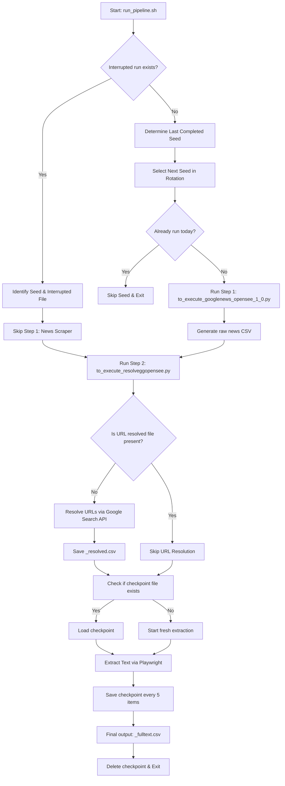

# Google News Scraper & Extraction Pipeline User Guide

This guide explains the architecture, execution, and automation flow of the Google News Scraper & Text Extraction Pipeline.

---

## 📌 Pipeline Overview
The pipeline is designed to search Google News for articles based on specified seed keywords, resolve their original publisher URLs, and extract their full article text using headless browser automation.



---

## 🔄 Rotation & Execution Strategy

The pipeline rotates through 6 available seed files located in the [clean_seeds/](file:///home/francois_oustry/google_news/clean_seeds) folder:
1. `seeds_buyside_eu_uae.csv`
2. `seeds_buyside_london.csv`
3. `seeds_buyside_us.csv`
4. `seeds_sellside_eu.csv`
5. `seeds_sellside_london.csv`
6. `seeds_sellside_us.csv`

### 1. Smart Rotation Logic
Rather than hardcoding seed execution based on dates, the pipeline analyzes the files in the directory dynamically:
* It looks at the latest completed output (`*_fulltext.csv`).
* It automatically selects the next seed in the rotation sequence.

### 2. Auto-Resumption of Interrupted Runs
If a run gets interrupted before the final `*_fulltext.csv` is produced:
* The pipeline automatically detects the incomplete raw file (e.g. `news_buyside_eu_uae_[timestamp].csv` without a corresponding `*_fulltext.csv`).
* It skips Stage 1 (News scraping) entirely to avoid calling Google News again.
* It targets the same seed and resumes Stage 2 immediately.

### 3. API Quota-Saving (URL Resolution Skip)
Stage 2 (`to_execute_resolveggopensee.py`) checks if the intermediate `*_resolved.csv` file was already successfully generated. If it exists, the script **skips the Google Custom Search API stage** and loads the file directly, preserving your Google API quota.

### 4. Text Extraction Checkpoints
Full text extraction using headless Playwright browsers is slow (~3-4s per page). To prevent loss of progress during network drops or timeouts, the script:
* Saves progress to a temporary `*_fulltext_checkpoint.csv` file every 5 articles.
* On resumption, it checks this checkpoint file and skips already-extracted articles, continuing seamlessly from where it stopped.
* Deletes the checkpoint file only upon successful completion.

---

## 🚀 How to Run the Pipeline

### 1. Automated (Daily Login Trigger)
The pipeline is hooked into your shell profile (`~/.bashrc`). 
* Every time you open or connect to your terminal, a check is run.
* If a run has not occurred yet today, it starts [run_pipeline.sh](file:///home/francois_oustry/google_news/run_pipeline.sh) in the background.
* It will not auto-run more than once a day (tracked by [.last_run_date](file:///home/francois_oustry/google_news/.last_run_date)).

### 2. Manual Execution
You can run the pipeline manually at any time. The script features a locking mechanism (`/tmp/google_news_pipeline.lock`) to prevent concurrent instances from running.
```bash
/home/francois_oustry/google_news/run_pipeline.sh
```
* **Successive Runs**: You can run successive seeds manually in the same day. The script will only skip a seed if that *specific* seed has already been run successfully today.

---

## 📁 Key Files & Logs

* **Scripts**:
  * [run_pipeline.sh](file:///home/francois_oustry/google_news/run_pipeline.sh): Master orchestrator bash script (Google News daily rotation & Risk.net weekly pipeline).
  * [fetch_risk_net.py](file:///home/francois_oustry/google_news/fetch_risk_net.py): Risk.net multi-category article extractor & people appointments logger.
  * [to_execute_googlenews_opensee_1_0.py](file:///home/francois_oustry/google_news/to_execute_googlenews_opensee_1_0.py): Stage 1 GNews scraper.
  * [to_execute_as_linkedin_v5.py](file:///home/francois_oustry/google_news/to_execute_as_linkedin_v5.py): Stage 2 LinkedIn post scraper.
  * [to_execute_resolveggopensee.py](file:///home/francois_oustry/google_news/to_execute_resolveggopensee.py): Stage 3 URL resolver & text extractor.
* **Logs & Reports**:
  * [pipeline_run.log](file:///home/francois_oustry/google_news/pipeline_run.log): Main log file capturing timestamps, selected seeds, step completions, and execution errors.
  * [risk_top_articles_by_category.md](file:///home/francois_oustry/google_news/risk_top_articles_by_category.md): Weekly summary report of top Risk.net articles across 5 desks and executive appointments.
* **State Files**:
  * [.last_run_date](file:///home/francois_oustry/google_news/.last_run_date): Tracks the date of the last automatic login trigger run.
  * [.last_risk_run_date](file:///home/francois_oustry/google_news/.last_risk_run_date): Tracks the date of the last Risk.net weekly run (triggers every 7 days).
